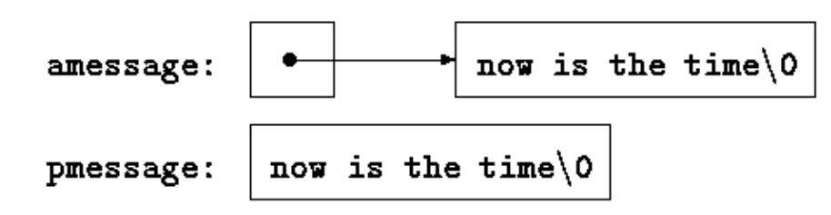
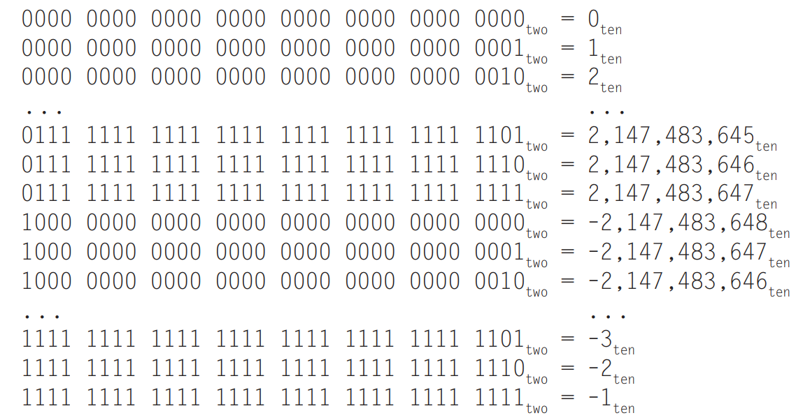
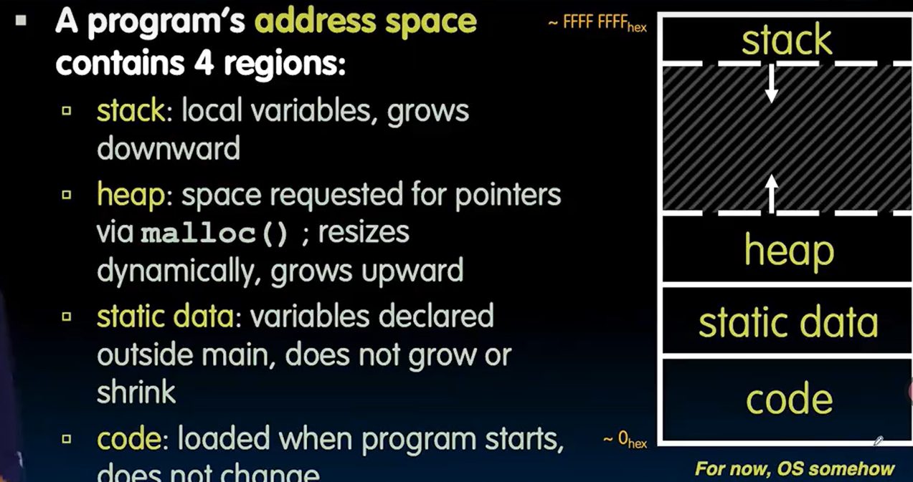
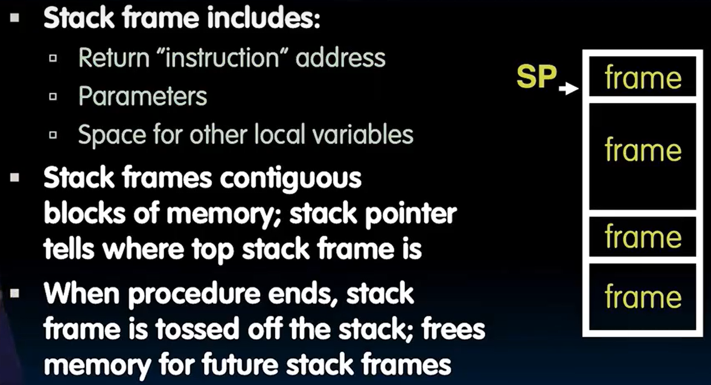

# Compiling and Running C

**Executable file** is `a.out`

```bash
$ gcc -o program program.c
$ ./program
```

`-o` used to specify the name of executable file that `gcc` creates.


**Debuging tools**: `cgdb` and `valgrind`

```c
#include <stdio.h>

int main(int argc, char *argv[]) {
    int i;
    int count = 0;
    int *p = &count;

    for (i = 0; i < 10; i++) {
        (*p)++; // Do you understand this line of code and all the other permutations of the operators? ;)
    }

    printf("Thanks for waddling through this program. Have a nice day.");
    return 0;
}
```

gdb will get into the printf to execute line by line when using `step`, but execute all of the printf when using `next`

1. Set the arguments that will be passed to the program when it’s run

```bash
set args input.txt output.txt
```

2. Create a breakpoint

```bash
break mian
break hello.c:10
```

3. Continue the program after stopping at a breakpoint

```bash
continue
c
```

4. Print the value of a variable( print <expression>

```bash
print x
print 1 + 2
```

5. Configure gdb displays the value of a variable after evey step

```bash
display x
```

6. Show a list of all variables and their values in the current funciton

```bash
info locals
```

7. Quit out of gdb

```bash
quit
```

`Ctrl+D`


**Use redirection in C for file input**

```bash
./a.out < fileName.txt
```

```c
#include <stdio.h>

#define BUFFERSIZE 100

int main (int argc, char *argv[])
{
    char buffer[BUFFERSIZE];
    fgets(buffer, BUFFERSIZE , stdin);
    printf("Read: %s", buffer);
    return 0;
}
```


## Valgrind

```c
#include <stdio.h>
int main() {
    int a[5] = {1, 2, 3, 4, 5}; // int array
    unsigned total = 0; 
    for (int j = 0; j < sizeof(a); j++) { // a is a real array, not a pointer. so sizeof(a) is 20.
        total += a[j];
    }
    printf("size of a is %d\n", sizeof(a));
    printf("sum of array is %d\n", total);
}
```

The output of `Valgrind ./no_segfault.c` would be

```bas
(base) bigorange@BigOrangesLapTop:~/projects/CS61C/lab01$ valgrind no_segfault_ex 
==58451== Memcheck, a memory error detector
==58451== Copyright (C) 2002-2017, and GNU GPL'd, by Julian Seward et al.
==58451== Using Valgrind-3.18.1 and LibVEX; rerun with -h for copyright info
==58451== Command: no_segfault_ex
==58451== 
size of a is 20
==58451== Conditional jump or move depends on uninitialised value(s)
==58451==    at 0x48D9AD6: __vfprintf_internal (vfprintf-internal.c:1516)
==58451==    by 0x48C379E: printf (printf.c:33)
==58451==    by 0x109200: main (no_segfault_ex.c:9)
==58451== 
==58451== Use of uninitialised value of size 8
==58451==    at 0x48BD2EB: _itoa_word (_itoa.c:177)
==58451==    by 0x48D8ABD: __vfprintf_internal (vfprintf-internal.c:1516)
==58451==    by 0x48C379E: printf (printf.c:33)
==58451==    by 0x109200: main (no_segfault_ex.c:9)
==58451== 
==58451== Conditional jump or move depends on uninitialised value(s)
==58451==    at 0x48BD2FC: _itoa_word (_itoa.c:177)
==58451==    by 0x48D8ABD: __vfprintf_internal (vfprintf-internal.c:1516)
==58451==    by 0x48C379E: printf (printf.c:33)
==58451==    by 0x109200: main (no_segfault_ex.c:9)
==58451== 
==58451== Conditional jump or move depends on uninitialised value(s)
==58451==    at 0x48D95C3: __vfprintf_internal (vfprintf-internal.c:1516)
==58451==    by 0x48C379E: printf (printf.c:33)
==58451==    by 0x109200: main (no_segfault_ex.c:9)
==58451== 
==58451== Conditional jump or move depends on uninitialised value(s)
==58451==    at 0x48D8C05: __vfprintf_internal (vfprintf-internal.c:1516)
==58451==    by 0x48C379E: printf (printf.c:33)
==58451==    by 0x109200: main (no_segfault_ex.c:9)
==58451== 
sum of array is 32114780
==58451== 
==58451== HEAP SUMMARY:
==58451==     in use at exit: 0 bytes in 0 blocks
==58451==   total heap usage: 1 allocs, 1 frees, 1,024 bytes allocated
==58451== 
==58451== All heap blocks were freed -- no leaks are possible
==58451== 
==58451== Use --track-origins=yes to see where uninitialised values come from
==58451== For lists of detected and suppressed errors, rerun with: -s
==58451== ERROR SUMMARY: 19 errors from 5 contexts (suppressed: 0 from 0)
```

When checking for the propagation of "uninitialized values," Valgrind typically only reports the **first point where the dirty data causes a problem**—such as in a conditional check, output operation, or calculation—**if the** **`--track-origins=yes`** **--track-origins=yes** **--track-origins=yes** **--track-origins=yes** **--track-origins=yes flag is not used**.


# Arrays and Pointers

In the most formulation, the array name in C would be transformed to a pointer pointing to the first element in the array.

two exceptions

1. `sizeof(a)` would return the bytes of the whole array
2. `&a` would return the whole address of the array. Type is `int (*)[N]` not `int*`

```c
void foo() {
    int a[5] = {1,2,3,4,5};
    // 这里 a 是一个真·数组，内存上真的有5个连续int
}
```

```c
void bar(int a[]) {
    // 或 void bar(int *a)
    // 这里 a 实际上就是一个 int* 指针
    // sizeof(a) would get the size of pointer
}
```

**Any name parameter is a pointer**: For efficiency and flexibility, when passing arrays as function parameters in C, only a pointer is actually passed, rather than copying the entire array.


The unary operator `*` is the **indirection** or **dereferencing** operator; When applied to a pointer, it accesses the object the pointer points to.


C passes arguments to functions by value, no direct way for the called function to alter a variable in the calling function.

```c
void swap(int *px, int *py) {
  int temp;
  temp = *px;
  *px = *py;
  *py = temp;
}
```


**Difference between an array name and a pointer**:

Pointer is a variable `pa = a` and `pa++` are legal. But an array name is not a variable `a=pa` and `a++`  are illegal.


There is an important difference between these definition

```c
char amessage[] = "now is the time";   /* 一个数组 */
char *pmessage = "now is the time";    /* 一个指针 */
```

`amessage` is an array, just big enough to hold the sequence of chars and `'\0'. amessage` will always point to the same storage.

`pmessage` is a pointer, may subsequently be modified to point elsewhere.




**Multi-dimensional Arrays**

```c
static char daytab[2][13] = {
    {0, 31, 28, 31, 30, 31, 30, 31, 31, 30, 31, 30, 31},
    {0, 31, 29, 31, 30, 31, 30, 31, 31, 30, 31, 30, 31}
};
```

```c
char *name[] = { "Illegal month", "Jan", "Feb", "Mar" };
```

```c
char aname[][15] = { "Illegal month", "Jan", "Feb", "Mar" };
```


# Structure

```c
struct point {
  int x;
  int y;
};

struct point pt;
struct point pt1 = {300, 400};
struct {
  int len; 
  char* str;
} *p;
++p->len

struct key {
    char *word;
    int count;
} keytab[] = {
    "auto", 0,
    "break", 0,
    // ...
    "while", 0
};

struct key {
    char *word;
    int count;
} keytab[] = {
    {"auto", 0},
    {"break", 0},
    // ...
    {"while", 0},
};
```


The structure operator `.` and `->` together with `()`  for function calls and `[]` for subscripts are at the top of the precedence hierarchy and bind very tightly.

```c
struct {
  int len; 
  char* str;
} *p;
++p->len
```

`++p->len` increments `len` not `p`, the implied parenthesization is `++(p->len)`


```c
typedef struct { // typedef struct最后面跟的才是别名，而普通struct后面跟的是变量的声明
    int a;
    int b;
} MyStruct;  // 这里MyStruct才是“别名”

MyStruct arr[10];
```


The recursive declaration of a node is correct, but it is necessary to use pointer.

```c
struct tnode { /* the tree node: */
    char *word;      /* points to the text */
    int count;       /* number of occurrences */
    struct tnode *left;  /* left child */
    struct tnode *right; /* right child */
};
```


**Union**

A single variable that can hold any of one of several types.

```c

```

The variable `u` will be large enough to hold the largest of the three types.

Use `u_type` to keep track of the current type stored in `u`

```c
if (utype == INT)
    printf("%d\n", u.ival);
else if (utype == FLOAT)
    printf("%f\n", u.fval);
else if (utype == STRING)
    printf("%s\n", u.sval);
else
    printf("bad type %d in utype\n", utype);
```

Use Union in Struct

```c
struct {
    char *name;  // 符号名称
    int flags;   // 标志位（属性）
    int utype;   // 用于指示 union 里当前存放的数据类型（比如 INT, FLOAT, STRING）
    union {
        int ival;
        float fval;
        char *sval;
    } u;         // 联合体变量名为 u
} symtab[NSYM];  // 声明结构体数组 symtab，长度为 NSYM
```

A union may only be initialized with a value of the type of its first member.

```c
union u_tag {
    int ival;
    float fval;
    char *sval;
};

union u_tag u = { 10 };          // 10 是 int，初始化 ival. 只能这么初始化
union u_tag u;
u.fval = 3.14f;  //初始化其他成员，必须先声明再赋值
```


**Bit-field**

```c
struct flags {
    unsigned int is_keyword : 1; // 占1位
    unsigned int is_extern  : 1; // 占1位
    unsigned int is_static  : 1; // 占1位
};
```

We can specific the number of bits ocuppied by a member.

Status of a switch

```c
struct {
    unsigned int power_on  : 1; // 开关机标志
    unsigned int error     : 1; // 错误标志
    unsigned int connected : 1; // 连接标志
} status;

status.power_on = 1; // 开
status.error = 0;    // 清除错误
```


# Command-line

**Command-line Arguments**

```c
int main(int argc, char *argv[])
```

```bash
echo hello, world
```

- `argv[0]` = `"echo"` (程序名)
- `argv[1]` = `"hello,"`
- `argv[2]` = `"world"`
- `argc` = 3

Print all of the paramters.

```c
#include <stdio.h>

int main(int argc, char *argv[]) {
    for (int i = 1; i < argc; i++) {
        printf("%s ", argv[i]);
    }
    printf("\n");
    return 0;
}
```

# Common Faults

**Segmentation fault**: occurs when a proogram crashes from trying to access memory that is not avaiable to it.

A segmentation fault only occurs if the memory you access happens to fall within a region that the operating system prohibits access to, such as an illegal address (unmapped virtual memory).

However, for small arrays, the memory beyond them often still lies within the stack space—containing other variables, return addresses, etc.—so the program may not crash immediately.


`++p` and `p++`

`buf[++p]` would get `buf[p+1]` and then `p = p + 1`

`buf[p++]`would get  `buf[p]`  and then  `p = p + 1`

# Signed and Unsigned Numbers

**least significant bit: rightmost bit**

**most significant bit**: leftmost bit

**overflow**: the result can not be represented by hardware bits

**1st Representation (sign and magnitude**

add a separate sign represented in a single bit.

**2st Representation( two's complement**

leading 0s means positive, leading 1s means negative



第一位代表 -$2^{-(n-1)}$。之后第依次代表$2^{n-2}$, $2^{n-3}$...

The two's complement representes from $-2^{n-1}$to $2^{n-1}-1$

1. Hardware only need to test the most significant bit to see if a number is positive or not
2. the left bits of a number using two's complement is 0s or 1s
3. The overflow occurs when adding two negative numbers resulting positive numbers, or adding two positive numbers resulting negative numbers

**Signed load: copy number with shorter rigister to larger rigister. copy the sign repeated to fill the rest of the register.( sign extension**

**Two Quick Way**

1. Negate a two's complement binary number, simply invert every 0 to 1 and every 1 to 0, then add one to the result.
2. **Sign extension**: replicates the most significant bit from the smaller quantity

**The name of Two's complement**: unsigned sum of n-bit number and its negative is $2^{n}$


# Memory Management

```c
void foo() {
    int *p, *q, x;
    int a[4];
    p = (int *) malloc (sizeof(int));
    q = &x;

    *p = 1; // p[0] would also work here
    printf("*p:%u, p:%u, &p:%u\n", *p, p, &p);

    *q = 2; // q[0] would also work here
    printf("*q:%u, q:%u, &q:%u\n", *q, q, &q);

    *a = 3; // a[0] would also work here
    printf("*a:%u, a:%u, &a:%u\n", *a, a, &a);
}
```



The content `p` pointing to is `1` and address `p` pointing to is `40` while the address of `p` is `12`


## Linked List

```c
struct Node {
    char *value;
    struct Node *next;
};
typedef struct Node *List;
```

add a string to an existing list

```c
List list_add(List list, char *string)
{
    struct Node *node = (struct Node*) malloc(sizeof(struct Node)); // allocate memory for a new node
    node->value = (char*) malloc(strlen(string) + 1); // allocate memory for string (includes \0 representing the end
    strcpy(node->value, string); // char *strcpy(char *dest, const char *src);
    node->next = list;
    return node;
}
```

## Memory locations

- **Static storage**: global variable storage, basically permanent, entire program run
- **The Stack**: local variable storage, parameters, return address (location of "activation records" in Java or "stack frame" in C)
- **The Heap** (dynamic malloc storage): data lives until deallocated by programmer




## Memory Management

`malloc` searchs the free lists for a block that is big enough. ( takes time

`free()` checks if the blocks adjacent to the freed block are also free.

- if so adjacent free blocks are merged
- otherwise, free block is just added to the free list

## When memory goes bad

```c
int *foo = (int *) malloc(sizeof(int) * 100);
int i;
...
for(i = 0; i <= 100; ++i) {
    foo[i] = 0;
}
```

```c
int *ptr() {
    int y;
    y = 3;
    return &y; // 返回y的地址
}

main() {
    int *stackAddr, content;
    stackAddr = ptr();
    content = *stackAddr;
    printf("%d", content);     // 第一次打印 3
    content = *stackAddr;
    printf("%d", content);     // 第二次打印 13451514
}
```

After calling `ptr()` , the local variable `y` has "expired," but its content might not have been overwritten yet.

At this point, `*stackAddr` may still read the old value of `y`.

However, before executing the second `printf`, the stack space might be overwritten or reused by subsequent function calls (like `printf`) or other operations.

**Never return the address of a local (stack) variable.**