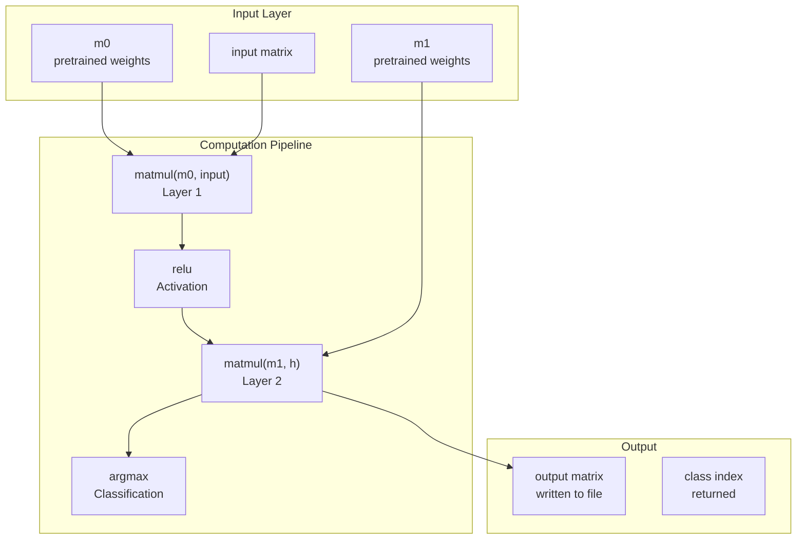

# 61C Project 2: CS61Classify

A neural network classifier implemented entirely in RISC-V assembly.

## Program Structure



## Algorithm

The program implements a 2-layer neural network classifier:

1. **Read matrices** - Load pretrained weights `m0`, `m1`, and `input` from binary files
2. **Layer 1** - `h = matmul(m0, input)` - Linear transformation
3. **Activation** - `h = relu(h)` - ReLU activation function
4. **Layer 2** - `o = matmul(m1, h)` - Linear transformation
5. **Output** - Write `o` to output file, return `argmax(o)` as classification

## Source Files

| File | Description |
|------|-------------|
| [main.s](src/main.s) | Entry point, calls `classify` |
| [classify.s](src/classify.s) | Main classification logic, orchestrates the pipeline |
| [read_matrix.s](src/read_matrix.s) | Reads binary matrix files |
| [write_matrix.s](src/write_matrix.s) | Writes matrix to binary file |
| [matmul.s](src/matmul.s) | Matrix multiplication |
| [dot.s](src/dot.s) | Dot product of two arrays |
| [relu.s](src/relu.s) | ReLU activation |
| [argmax.s](src/argmax.s) | Returns index of maximum value |
| [abs.s](src/abs.s) | Absolute value |
| [utils.s](src/utils.s) | Utility functions (print, exit) |

## Usage

```
./classify <M0_PATH> <M1_PATH> <INPUT_PATH> <OUTPUT_PATH>
```

- `M0_PATH` - Filepath to pretrained weight matrix m0
- `M1_PATH` - Filepath to pretrained weight matrix m1
- `INPUT_PATH` - Filepath to input matrix
- `OUTPUT_PATH` - Filepath to write output matrix

## Binary File Format

Matrix files use the following binary format:
- First 4 bytes: number of rows (int32)
- Next 4 bytes: number of columns (int32)
- Remaining bytes: matrix elements in row-major order (int32)

## Exit Codes

| Code | Meaning |
|------|---------|
| 0 | Success |
| 26 | Malloc failed |
| 27 | File open failed |
| 28 | File close failed |
| 29 | File read failed |
| 31 | Incorrect number of command line arguments |
| 36 | Invalid number of elements in dot product |
| 37 | Invalid stride in dot product |
| 38 | Invalid matrix dimensions in matmul |
